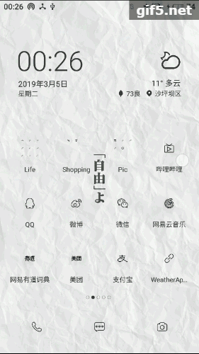

## Weather application

This is a weather app developed base on https://github.com/dragona/weather-application.

It use an api from http://www.shujuzhihui.cn/apiDetails?id=2030, which is http://api.shujuzhihui.cn/api/weather/dailyweather?appKey=efcdee809802446f9e3c5f291195052f&city=Chongqing

Expected: application behavior:
Each time the application has started, it will update the presented weather with the correct forecast of the day.

When the blue button on the top part is pressed, the application should refresh the content by updating the weather forecast presented. When the weather shown in the application has been updated, a toast should inform the user that the app updated.

*The button keeps flashing because of gif's low-quality. I actually tap the button when the little circle on gif appears.  

Thanks Dr.Feno and assistant teacher for the help.
